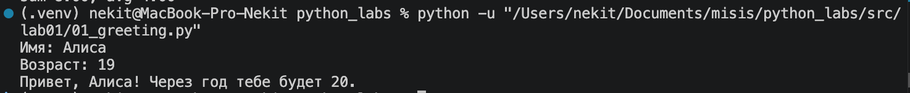
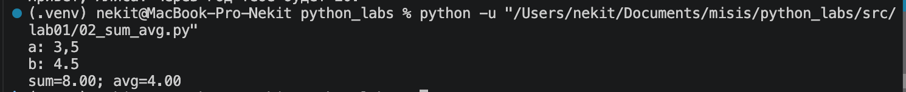
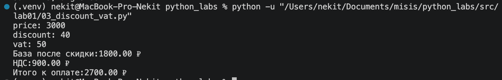
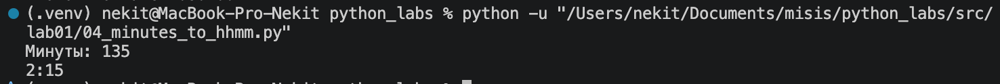
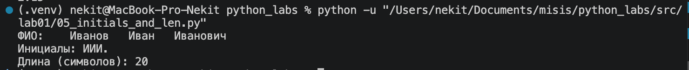
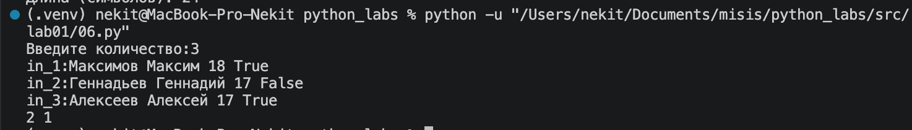

# python_labs

# Хохлов Никита

---

# Группа БИВТ-26-6-1

---

# Лабораторная работа №1

---

## 1 Задание

---

## 2 Задание

---

## 3 Задание

---

## 4 Задание

---

## 5 Задание

---

## 6 Задание

